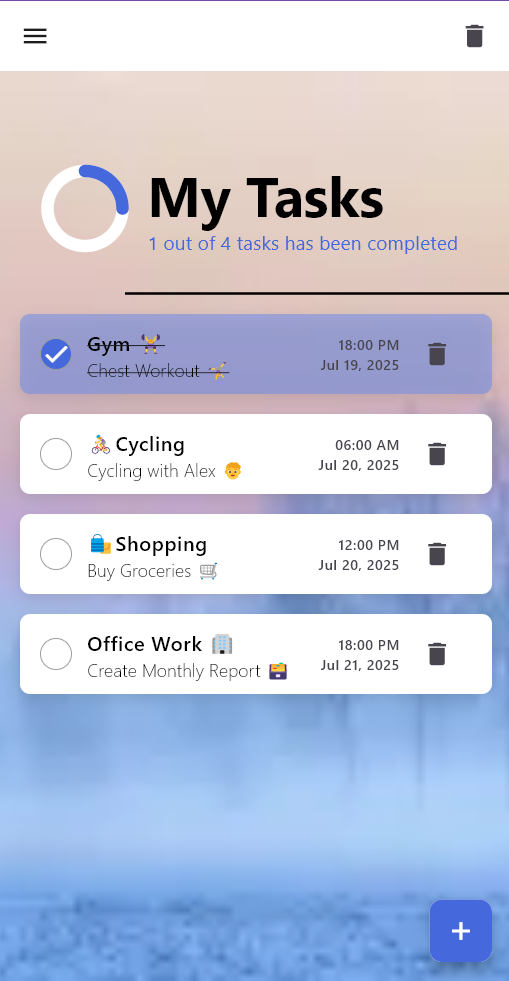
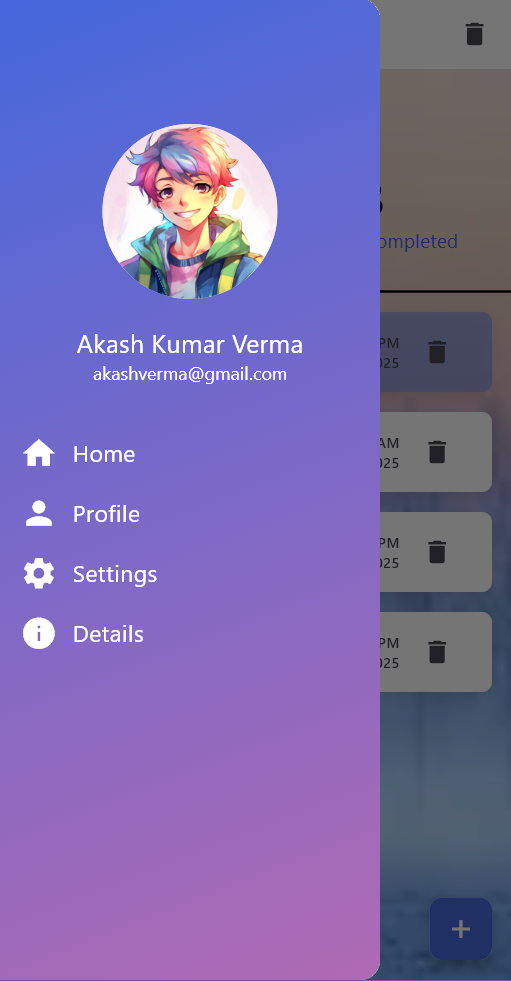
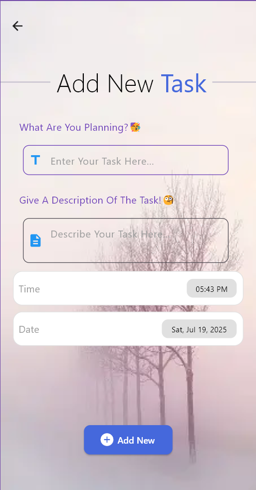
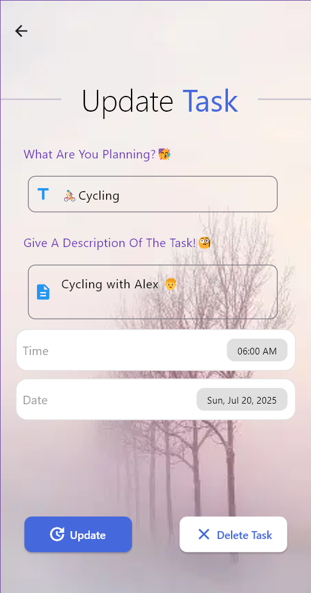
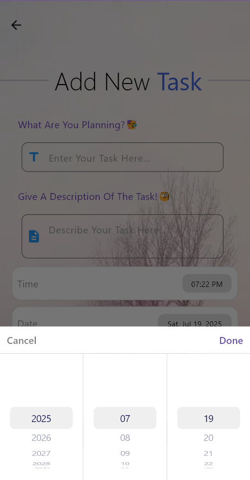
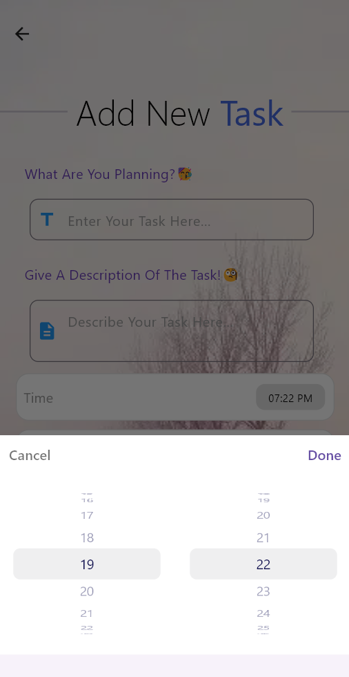

# TodoList Flutter App

A beautiful and functional todo application built with Flutter, featuring task management with date and time selection, and persistent storage using Hive database.

## 📱 Screenshots

### App Overview






### Features in Action


## ✨ Features

- ✅ Create, update, and delete tasks
- 📅 Date and time selection for tasks
- 💾 Persistent storage with Hive database
- 🎨 Beautiful UI with custom themes and colors
- 📱 Responsive design
- 🔄 Real-time task updates

## 🛠️ Technologies Used

- **Flutter** - UI framework
- **Hive** - Local database for data persistence
- **Cupertino Date Picker** - Enhanced date/time selection
- **Intl** - Internationalization and date formatting

## 📋 Prerequisites

Before running this application, make sure you have:

- Flutter SDK installed (version 3.0 or higher)
- Dart SDK
- Android Studio / VS Code with Flutter extensions
- An Android/iOS device or emulator

## 🚀 Getting Started

### Installation

1. **Clone the repository**
   ```bash
   git clone <your-repository-url>
   cd todolist
   ```

2. **Install dependencies**
   ```bash
   flutter pub get
   ```

3. **Run the application**
   ```bash
   flutter run
   ```

## 📁 Project Structure

```
todolist/
├── android/                  # Android platform files
├── assets/                   # App assets
│   ├── images/              # Image assets
│   │   ├── home1.png
│   │   ├── home2.png
│   │   ├── drawer.png
│   │   ├── addTask.png
│   │   ├── updateTask.png
│   │   ├── date.png
│   │   └── time.png
│   └── lotties/             # Lottie animation files
│       ├── Lego.json
│       └── Task.json
├── ios/                     # iOS platform files
├── lib/                     # Main application code
│   ├── main.dart           # App entry point
│   ├── data/               # Data layer
│   │   └── hive_data_store.dart  # Hive database operations
│   ├── models/             # Data models
│   │   ├── task.dart       # Task model definition
│   │   └── task.g.dart     # Generated Hive adapter
│   ├── utils/              # Utility classes and constants
│   │   ├── app_colors.dart # Color constants
│   │   ├── app_str.dart    # String constants
│   │   └── constants.dart  # App constants
│   └── views/              # UI screens and components
│       ├── home/           # Home screen
│       │   ├── home_view.dart      # Main home screen
│       │   ├── components/         # Home screen components
│       │   │   ├── drawer.dart     # Navigation drawer
│       │   │   └── fab.dart        # Floating action button
│       │   └── widget/             # Home screen widgets
│       │       └── task_widget.dart # Individual task widget
│       └── tasks/          # Task management screens
│           ├── task_view.dart      # Task creation/editing screen
│           ├── components/         # Task screen components
│           │   ├── date_time_selection.dart # Date/time picker
│           │   └── rep_textfield.dart       # Reusable text field
│           └── widgets/            # Task screen widgets
│               └── task_view_app_bar.dart  # Custom app bar
├── linux/                   # Linux platform files
├── macos/                   # macOS platform files
├── test/                    # Test files
├── web/                     # Web platform files
├── windows/                 # Windows platform files
├── pubspec.yaml            # Dependencies and project configuration
├── README.md               # Project documentation
└── LICENSE                 # License file
```

## 🎯 Key Components

### Task Model
The app uses a custom Task model with the following properties:
- Title and description
- Creation date and time
- Hive database integration for persistence

### Task Management
- **Create**: Add new tasks with title, description, date, and time
- **Update**: Edit existing tasks
- **Delete**: Remove tasks from the list
- **Persist**: All data is stored locally using Hive database

## 🎨 UI/UX Features

- Custom color scheme with primary colors
- Responsive text fields for task input
- Interactive date and time pickers
- Smooth animations and transitions
- Background images for enhanced visual appeal

## 📱 App Flow

1. **Home Screen**: View all tasks
2. **Task Creation**: Add new tasks with details
3. **Task Editing**: Update existing tasks
4. **Task Management**: Delete or modify tasks

## 🔧 Configuration

### Dependencies
The app uses the following key dependencies:
- `flutter_cupertino_date_picker_fork` - Enhanced date/time selection
- `hive` - Local database
- `intl` - Date formatting

### Custom Styling
- Custom colors defined in `app_colors.dart`
- String constants in `app_str.dart`
- Reusable components for consistent UI

## 🤝 Contributing

1. Fork the repository
2. Create your feature branch (`git checkout -b feature/AmazingFeature`)
3. Commit your changes (`git commit -m 'Add some AmazingFeature'`)
4. Push to the branch (`git push origin feature/AmazingFeature`)
5. Open a Pull Request

## 📄 License

This project is licensed under the MIT License - see the [LICENSE](LICENSE) file for details.

## 👨‍💻 Author

**Your Name**
- GitHub: [akashverma55](https://github.com/akashverma55)
- Email: akvakv150@gmail.com

## 🙏 Acknowledgments

- Flutter team for the amazing framework
- Hive database for efficient local storage
- Community contributors and package maintainers

## 📞 Support

If you have any questions or need help, please:
- Open an issue on GitHub
- Contact me via email
- Check the Flutter documentation

---

**Made with ❤️ using Flutter**
